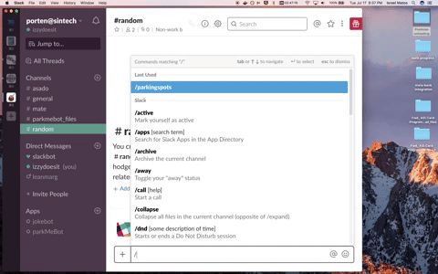
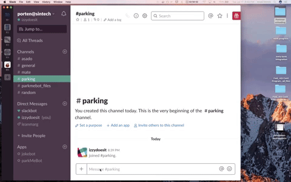

# @parkMeBot

__the Slack bot that finds you a spot!__

/parkingspots        |  /parkme 
:-------------------------:|:-------------------------:
 | 

## Overview

Ever needed a __parking spot__ and wondered if your co-workers had any available?  Did you get the monthly parking pass at work and wish you could make some __extra cash__ when you weren't using your spot? 

Meet parkMeBot and consider your parking problem handled!

This Slack API integration lets you find an open parking spot at work (or someone to rent your spot) on the date of your choice through our matching algorithm.  Those days of fruitlessly asking around the office one person at a time are gone! 

Just enter your respective slash command (__/parkme__ to find a spot or __/rentspot__ to put yours up for rent) and parkMeBot will let you know when its found you a match.

If you'd rather not wait, you can also get a CSV file full of parking spot requests or offers in the parking pool through our convenient __/parkingspots__ command.

## API

### Slash commands 

* __/parkingspots__ command triggers a workflowsto get a report of all bid requests or offers for parking in CSV format uploaded to a channel.  

* __/parkme__ command triggers bid-submitting user flow and lets you instantly if a matching offer is found. 
* __/rentspot__, the previous command's complement, launches offer-submitting flow and also notifies you if there's a match.

### Interactive Components

  parkMeBot posts messages to channel (when invoked by slash command) with an interactive select dropdown menu to pick from either bids or offers for the /parkingspots command.

  Also uses interactive select dropdown menu in response message to __/parkme__ and __/rentspot__ slash commands so user can pick from range of dates to submit their respoective parking spot bid or offer.

### Bot User

  We created a bot user so we could encapsulate our parking solution in one workspace entity capable of multiple functions and provides users a single access point for their parking needs. This creates a better user experience by personifying our application in a polished client-facing A.I. user.

## Key decisions

* **Designed with User Experience first**

  Our workspace bot attempts to solve a real-life problem that plagues our car-centric culture, especially in the local SF Bay area where parking is in high demand and prices are even higher.

  Bot user-flow interaction is meant to be as _frictionless_ as possible, minimizing the number of steps needed to submit an order for your parking needs and providing user-friendly confirmations when a user has taken an action interacting with our bot while making _asynchronous_ calls in the background.  It also updates a user when it has finished a task and _uploads a file_ to a channel for easy centralized access within the Slack application.

  _Slash commands_ seemed like the clear way to go in this case since they can be invoked from any channel without needing the bot to be a member and listening in on that channel. This option also fit in well with our goal of designing and implementing a ubiquitous parking solution that can serve all the members of the workspace from anywhere in the Slack application.

* **Persisting orders**

  The parkMeBot aims to be the ongoing _one-stop solution_ for all your parking spot-trading needs at work. As such, saving orders in a database for later querying and retrieval became necessary. This decision is key as we built with scale in mind. There might not be any matching orders at any given time when a user submits an order so the need for _persistence_ became clear in order to better serve the workspace's members over multiple interactions.

  Using a _NoSQL_ database became the clear choice over SQL in this context because we don't foresee needing table joins since we're only storing order objects.  It also anticipates scaling with a database solution that has sharding built in.

  Reliability was definitely a concern and while SQL would win here, we traded that for faster _performance_ and the use of a cost-saving _cloud-based_ storage solution in MongoLab.


## Testing Plan

The task of QA'ing this application will mostly be manual. I developed locally using [localtunnel](https://localtunnel.github.io) to be able to receive commands and actions to the Node server running on my local machine and tested the functionality of the code one piece at a time in isolation for typical unit testing before moving on to full integration testing.

My testing and development made _heavy use of the logging_ functions made available by the [**Tracer**](https://github.com/baryon/tracer) module in order to know what was happening at every part of the code. I also made routine use of _passing error-handling callbacks_ to my asynchronous calls that would typically log errors first before any other logic.

If i'm not able to access the source code while testing, as might be the case when testing someone else's production code, I would rely on _manual_ testing through the UI. In my testing, I would intentionally try to __break the application__ by trying all kinds of input and going through the flow repeatedly while trying every possible selection and clicking every possible interactive component in order to see the limits of the application. 

For me, it's important to go through every possible **unique** user flow from end to end in order to fully test anything.  This is key because any flow you don't vet will certainly be discovered by a user, given enough time running on production. 

With that in mind, i've outlined the key _assertions_ I would make while testing this application:

* **User flows**

  * when user invokes *bid/offer submitting flow* in a channel, it should:
    - receive POST request to __/command__ subendpoint
    - _respond_ with POST to same channel with:
      - a friendly message
      - one interactive _select_ component with list of _date_ options
    - receive POST request to __/actions__ endpoint with all necessary data
    - respond to user action with _confirmation_ message
    - _query_ database for matching order and return in confirmation message
    - __asynchronously__ insert_ order into database
    
  * when user invokes *parking spot report request flow* in channel, it should:
    - receive POST request to __/command__ subendpoint
    - _respond_ with POST to same channel with:
      - a friendly message
      - one interactive _select_ component with list of _order type_ options
    - receive POST request to __/actions__ endpoint with all necessary data
    - respond to user action with _confirmation_ message
    - __asynchronously__ _generate CSV_ report of orders and save file locally
    - __asynchronously__ _upload CSV_ file to specified upload channel
    - _notify user_ in channel report was requested when report has finished uploading

* **Database**

  * when inserting an order, it should:
    - require a __userId__ value
    - require a __date__ value
    - require a __direction__ value
    - persist order in database (able to retrieve)

  * when querying the order pool, it should:
    - search by date first
    - match only _opposite direction_ of incoming order
    - return only __one__ match or empty array if none found
    - if no match, should not remove **any** orders from order pool
    - if matched, remove **BOTH** orders from order pool
    - both matched orders are no longer retrievable from database
    - update ALL master and slave databases (in case of db redundancy)

## Improvements

* **Better flow for user experience**

  Upon reflection, including two buttons instead of a select menu in our interactive component for our __/parkingspots__ command might have been better UX since a menu of only two options seems unnecessary. It also reduces user friction even more since it makes it **ONE** click instead of two in order to dispatch the command to fetch a CSV order report.

* **Using local time vs UTC**

  This was an issue I wrestled with in building this application and found it hard to justify using UTC time when it could easily interfere with generating list of days for a local user to pick from to submit a bid/offer on. If a user on PST time submitted a bid/offer after 5pm, the calendar day generating algorithm would *skip a day* in its process of generating the next 7 days to pick from.

  As the bot application scales, this range of days would be expanded out to months and involve a more complex *interactive calendar* component that doesn't currently exist.  If I had more time to work on this application, this would be the first thing I would build in order to give my users a wider array of choices.

* **Indexing & Searching**

  As of right now, we are only querying the database when a new order comes in. This *minimizes* our searches to only when the database state changes. We could stand to improve our matching algorithm however, if we were dealing with large amounts of data.
  
  The matching algorithm currently searches by date field in the database, which is a string comprised of day and date for human readability. Given the current state of the app having only a one week range for its time window, this algorithm is simple and effective.  Searching for the date makes it easy to find an order's complement since only orders on that date can match with our incoming order at the time of query and there would be a much smaller pool of orders on any given date. 
  
  That leaves us with just having to match the opposite direction of the incoming order in order from among the pool of date-matched orders. We could add __indexing__ on this field in order to make it faster to search by date, and would be the first improvement I would make on the matching algorithm and database querying. 

  I have also included an __id__ field in our *model* that is composed of the desired date of the order as an ISO string and UNIX timestamp of when order was submitted. This was forward thinking on how to deal with the issue of multiple matching orders in database. I would complete this implementation by simply _resolving using timestamp_, implementing a first-in-first-out (FIFO) policy. This field could also be a possible indexing candidate

## Getting Started

### Prerequisites

```
node 8.9.4
npm 6.2.0
```

### Installing
From the command terminal, clone the repository to your local directory...
```
$ git clone https://www.gihub.com/izzydoesit/parkMeBot.git
$ cd parkMeBot
```

Then run npm commands to install all dependencies and run the development server.  

```
$ npm install
$ npm start dev
```

### Dependencies

* [Babel/ES6](http://babeljs.io) - JavaScript ES6 compiler
* [Body Parser](https://www.npmjs.com/package/body-parser) - Node.js request body parsing middleware
* [Botkit](https://botkit.ai) - bot making toolkit
* [Config](https://www.npmjs.com/package/config) - application configuration
* [CSV Write Stream](https://www.npmjs.com/package/csv-write-stream) - CSV encoder stream
* [ESLint](http://eslint.org) - JavaScript Linter (configured w/ AirBnB style guide)
* [Express](http://expressjs.com) - web application framework
* [Mkdirp](https://www.npmjs.com/package/mkdirp) - directory creating tool
* [Mongoose](http://mongoosejs.com) - database framework
* [Morgan](https://github.com/expressjs/morgan) - HTTP request logger middleware
* [Request](https://github.com/request/request) - HTTP request client
* [Tracer](https://github.com/baryon/tracer) - logging library

### External Dependencies

* [MongoLab](https://mlab.com) hosted database

# Author
* **Israel Matos** ([Portfolio](https://www.israeldmatos.com) | [LinkedIn](https://linkedin.com/in/israedmatos) | [Github](https://github.com/izzydoesit))

# License

This project is licensed under the Apache 2.0 License - see [LICENSE.md](LICENSE.md) file for details
